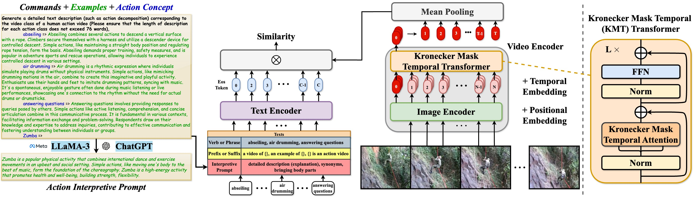
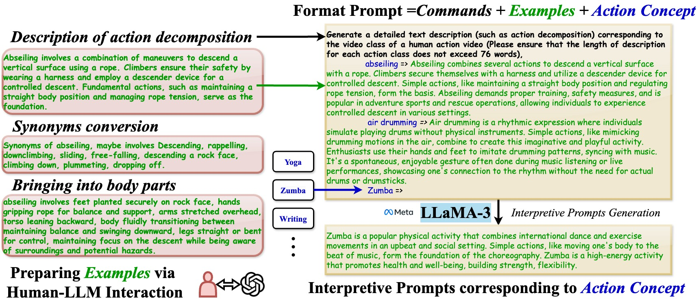

# [ICLR'2025] - Kronecker Mask and Interpretive Prompts are Language-Action Video Learners

> [**Kronecker Mask and Interpretive Prompts are Language-Action Video Learners**](https://arxiv.org/abs/2502.03549)<br>
> Accepted by ICLR 2025<br>
> Jingyi Yang, Zitong Yu, Xiuming Ni, Jia He, Hui Li

This is an official implementation of [CLAVER](https://arxiv.org/abs/2502.03549), a framework which shifts from
the alignment of visual objects and nouns in CLIP to the alignment of action behaviors and verbs.

<center><b>Framework:</b></center>
<div align="center">
    
</div>

<center><b>Kronecker Mask Attention:</b></center>
<div align="center">
    
</div>

<center><b>Interpretive Prompt:</b></center>
<div align="center">
    
</div>


# News
- :sparkles: **[January, 2025]** Our paper has been accepted by ICLR2025.


# Environment Setup
To set up the environment, you can easily run the following command:
```
conda create -n CLAVER python=3.7
conda activate CLAVER
pip install -r requirements.txt
```

Install Apex as follows:
```
git clone https://github.com/NVIDIA/apex
cd apex
pip install -v --disable-pip-version-check --no-cache-dir --global-option="--cpp_ext" --global-option="--cuda_ext" ./
```

For llama3 environment setup, you can refer to [Meta-llama3](https://github.com/meta-llama/llama3).


# Data Preparation

For downloading the Kinetics datasets, you can refer to [mmaction2](https://github.com/open-mmlab/mmaction2/blob/master/tools/data/kinetics/README.md) or [CVDF](https://github.com/cvdfoundation/kinetics-dataset). For [UCF-101](https://www.crcv.ucf.edu/data/UCF101.php) and [HMDB-51](https://serre-lab.clps.brown.edu/resource/hmdb-a-large-human-motion-database/), you can easily get them from the official website.

Due to limited storage, we decord the videos in an online fashion using [decord](https://github.com/dmlc/decord).

We provide the following two ways to organize the dataset:

- **Option \#1:** Standard Folder. For standard folder, put all videos in the `videos` folder, and prepare the annotation files as `train.txt` and `val.txt`. Please make sure the folder looks like this:
    ```Shell
    $ ls /PATH/TO/videos | head -n 2
    a.mp4
    b.mp4

    $ head -n 2 /PATH/TO/train.txt
    a.mp4 0
    b.mp4 2

    $ head -n 2 /PATH/TO/val.txt
    c.mp4 1
    d.mp4 2
    ```


-  **Option \#2:** Zip/Tar File. When reading videos from massive small files, we recommend using zipped files to boost loading speed. The videos can be organized into a `tar` file `videos.tar`, which looks like:
    ```Shell
    $ tar -tvf /PATH/TO/videos.tar | head -n 2
    a.mp4
    b.mp4
    ```
    The `train.txt` and `val.txt` are prepared in the same way as option \#1.

Since that our method employs semantic information in text labels, rather than traditional one-hot label, it is necessary to provide a textual description for each video category. For example, we provide the text description of Kinetics-400 in the file `labels/kinetics_400_labels.csv`. Here is the format:
```Shell
$ head -n 5 labels/kinetics_400_labels.csv
id,name
0,abseiling
1,air drumming
2,answering questions
3,applauding
```
The `id` indicates the class id, while the `name` denotes the text description.

For the **Interpretive Prompts** generation, you can use following command to generate (after you setup the llama3 environment):
```
torchrun --nproc_per_node 1 data_prepare/llama3/action_descriptions.py \
    --ckpt_dir Meta-Llama-3-8B/ \
    --tokenizer_path Meta-Llama-3-8B/tokenizer.model \
    --max_seq_len 512 --max_batch_size 4
```

# Model Zoo
- Fully-supervised on Kinetics-400:

    | Model              | FLOPs(G) | Input | Top-1 Acc.(%) | Top-5 Acc.(%) |
    |--------------------|----------|--|---------------|---------------|
    | CLAVER-B/32 (KMT)  | 33       |8x224 | 81.5          | 95.5          |
    | CLAVER-B/32 (KMCT) | 33       |8x224 | 81.4          | 95.5          |
    | CLAVER-B/32 (KMT)  | 64       |16x224 | 82.4          | 95.9          |
    | CLAVER-B/32 (KMCT) | 64       |16x224 | 82.6          | 95.9          |
    | CLAVER-B/16 (KMT)  | 122      |8x224 | 84.3          | 96.3          |
    | CLAVER-B/16 (KMCT) | 122      |8x224 | 84.1          | 96.2          |
    | CLAVER-B/16 (KMT)  | 241      |16x224 | 85.9          | 97.3          |
    | CLAVER-B/16 (KMCT) | 241      |16x224 | 86.0          | 97.2          |
    | CLAVER-B/14 (KMT)  | 558      |8x224 | 88.1          | 97.7          |
    | CLAVER-B/14 (KMCT) | 558      |8x224 | 87.9          | 97.7          |
    | CLAVER-B/14 (KMT)  | 2488     |16x336 | 88.8          | 98.1          |
    | CLAVER-B/14 (KMCT) | 2488     |16x336 | 88.9          | 98.0          |

- Few-shot:

    | Model              | Dataset | K | FLOPs(G) | Input| Top-1 Acc.(%) |
    |--------------------|--|--|----------|--|---------------|
    | CLAVER-B/16 (KMT)  | HMDB-51 | 2 | 482      | 32x224 | 58.6          |
    | CLAVER-B/16 (KMCT) | HMDB-51 | 2 | 482      | 32x224 | 58.3          |
    | CLAVER-B/16 (KMT)  | HMDB-51 | 4 | 482      |32x224 | 63.9          |
    | CLAVER-B/16 (KMCT) | HMDB-51 | 4 | 482      |32x224 | 64.5          |
    | CLAVER-B/16 (KMT)  | HMDB-51 | 8 | 482      |32x224 | 68.0          |
    | CLAVER-B/16 (KMCT) | HMDB-51 | 8 | 482      |32x224 | 68.6          |
    | CLAVER-B/16 (KMT)  | HMDB-51 |16 | 482      |32x224 | 72.5          |
    | CLAVER-B/16 (KMCT) | HMDB-51 |16 | 482      |32x224 | 72.9          |
    | CLAVER-B/16 (KMT)  | UCF-101 | 2 | 482      |32x224 | 89.7          |
    | CLAVER-B/16 (KMCT) | UCF-101 | 2 | 482      |32x224 | 90.0          |
    | CLAVER-B/16 (KMT)  | UCF-101 | 4 | 482      |32x224 | 92.9          |
    | CLAVER-B/16 (KMCT) | UCF-101 | 4 | 482      |32x224 | 92.9          |
    | CLAVER-B/16 (KMT)  | UCF-101 | 8 | 482      |32x224 | 96.1          |
    | CLAVER-B/16 (KMCT) | UCF-101 | 8 | 482      |32x224 | 96.6          |
    | CLAVER-B/16 (KMT)  | UCF-101 | 16 | 482      |32x224 | 98.0          |
    | CLAVER-B/16 (KMCT) | UCF-101 | 16 | 482      |32x224 | 98.1          |

- Zero-shot:

  | Model              | Dataset | FLOPs(G)| Input | Top-1 Acc.(%) |
  |--------------------|--|--|--|---------------|
  | CLAVER-B/16 (KMT)  | HMDB-51 |482|32x224 | 54.1          |
  | CLAVER-B/16 (KMCT) | HMDB-51 |482|32x224 | 54.0          |
  | CLAVER-B/16 (KMT)  | UCF-101 |482|32x224 | 78.6          |
  | CLAVER-B/16 (KMCT) | UCF-101 |482|32x224 | 78.4          |
  | CLAVER-B/16 (KMT)  | Kinetics-600 |482|32x224 | 73.8          |
  | CLAVER-B/16 (KMCT) | Kinetics-600 |482|32x224 | 74.1          |


# Train
The config files lie in `configs`. For example, to train CLAVER-B/32 with 8 frames on Kinectis-400 on 8 GPUs, you can run
```
python -m torch.distributed.launch --nproc_per_node=8 \ 
main.py -cfg configs/k400/32_8.yaml --output /PATH/TO/OUTPUT --accumulation-steps 4
```

**Note:**
- We recommend setting the total batch size to 256. If memory or #GPUs is limited, you can use `--accumulation-steps` to maintain the total batch size. Specifically, here the effective total batch size is 8(`GPUs_NUM`) x 8(`TRAIN.BATCH_SIZE`) x 4(`TRAIN.ACCUMULATION_STEPS`) = 256.
- Please specify the data path in config file(`configs/*.yaml`). Also, you can set them by attaching an argument `--opts DATA.ROOT /PATH/TO/videos DATA.TRAIN_FILE /PATH/TO/train.txt DATA.VAL_FILE /PATH/TO/val.txt`. Note that if you use the tar file(`videos.tar`), just set the `DATA.ROOT` to `/PATH/TO/videos.tar`. For standard folder, set that to `/PATH/TO/videos` naturally.
- The pretrained CLIP will be automatically downloaded. Of course, you can specify it by using `--pretrained /PATH/TO/PRETRAINED`.

# Test
For example, to test the CLAVER-B/32 with 8 frames on Kinectis-400, you can run
```
python -m torch.distributed.launch --nproc_per_node=8 main.py \
-cfg configs/k400/32_8.yaml --output /PATH/TO/OUTPUT --only_test --resume /PATH/TO/CKPT \
--opts TEST.NUM_CLIP 4 TEST.NUM_CROP 3
```

**Note:**
- According to our experience and sanity checks, there is a reasonable random variation about accuracy when testing on different machines.
- There are two parts in the provided logs of the fully-supervised experiments. The first part is conventional training followed by validation per epoch with single-view. The second part, attached at the end of the log, is the multiview (3 crops x 4 clips) inference logs.


# Bibtex
If this project is useful for you, please consider citing our paper :mega:
```
@article{yang2025kronecker,
  title={Kronecker Mask and Interpretive Prompts are Language-Action Video Learners},
  author={Yang, Jingyi and Yu, Zitong and Ni, Xiuming and He, Jia and Li, Hui},
  journal={arXiv preprint arXiv:2502.03549},
  year={2025}
}
```
# Acknowledgements
Parts of the codes are borrowed from [mmaction2](https://github.com/open-mmlab/mmaction2), [Swin](https://github.com/microsoft/Swin-Transformer), [CLIP](https://github.com/openai/CLIP) and [X-CLIP](https://github.com/microsoft/VideoX/tree/master/X-CLIP). Sincere thanks to their wonderful works.
